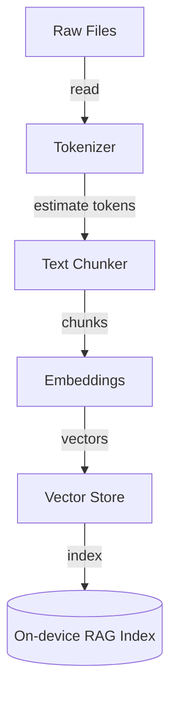
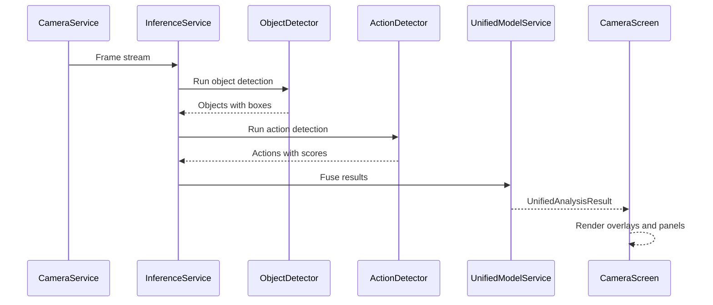
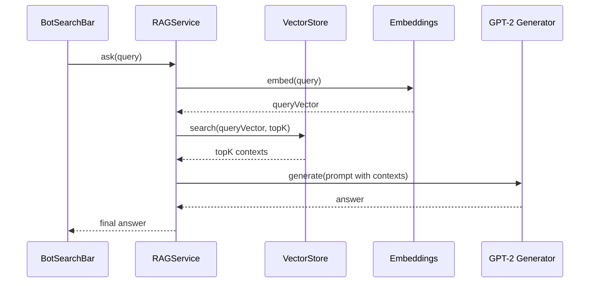
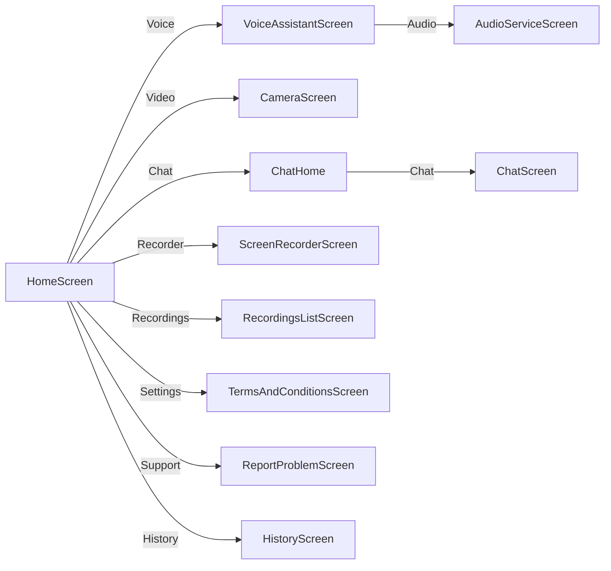

<h1>Worlkflow Documentation</h1>

# Chat Module

The **Chat Module** provides an AI-driven messaging interface. It defines data models, UI widgets, and screens to facilitate conversational interactions between the user and the health assistant.

## Data: messages_bot.dart

This file holds sample messages exchanged between user and bot.  
- Defines a global `List<Message>` named `messages`.  
- Showcases both text and media messages.  

```dart
import 'package:listen_iq/screens/chat/entities/message_bot.dart';

List<Message> messages = [
  Message(type: MessageType.text, sender: MessageSender.bot,
          text: "Hello! How can I help you today?"),
  // ... more sample entries ...
  Message(type: MessageType.media, sender: MessageSender.bot,
          mediaUrl: "https://plus.unsplash.com/..."),
];
```

## Entities

### message_bot.dart

Defines the core `Message` entity and its presentation properties.  

- **Message**: Holds type, sender, optional text or media URL, and timestamp.  
- **MessageExtension**: Provides UI styling:
  - `textColor`
  - `backgroundGradient`
  - `getBorderRadius(isFirst, isLast)`  
- Enums: `MessageType { text, media }`, `MessageSender { bot, user }`.  

```dart
class Message {
  final MessageType type;
  final MessageSender sender;
  final String? text;
  final String? mediaUrl;
  final DateTime timestamp;
  // ...
}

extension MessageExtension on Message {
  Color get textColor { /* ... */ }
  Gradient get backgroundGradient { /* ... */ }
  BorderRadius getBorderRadius({bool isFirst, bool isLast}) { /* ... */ }
}
```

### message_group.dart

Groups consecutive messages from the same sender.  
- `List<Message> messages`  
- `MessageSender sender`  

```dart
class MessageGroup {
  final List<Message> messages;
  final MessageSender sender;
  MessageGroup({required this.messages, required this.sender});
}
```

## Widgets

### bot_search_bar.dart

Provides the input bar for user queries.  

- **TextFormField** for user to type queries.  
- **_sendMessage()**:  
  1. Emits user message.  
  2. Shows “Thinking.” indicator.  
  3. Calls `askQuestion(query)` from `answerUser.dart`.  
  4. Emits bot response or error.  

```dart
Future<void> _sendMessage() async {
  final query = _controller.text.trim();
  if (query.isEmpty) return;
  widget.onMessageSent?.call(userMessage);
  widget.onTyping?.call();
  widget.onMessageSent?.call(typingMessage);
  final botText = await askQuestion(query);
  widget.onMessageSent?.call(botResponse);
}
```

### chat_message_widget.dart

Renders each `MessageGroup` as chat bubbles.  

- Aligns left for bot, right for user.  
- Uses `backgroundGradient` and `textColor`.  
- Renders images for media messages with loading/error states.  

```dart
Align(
  alignment: group.sender == MessageSender.bot
      ? Alignment.centerLeft : Alignment.centerRight,
  child: Column(
    crossAxisAlignment: group.sender == MessageSender.bot
        ? CrossAxisAlignment.start : CrossAxisAlignment.end,
    children: group.messages.map((m) => _buildMessageContent(m)).toList(),
  ),
)
```

### media_message.dart

A specialized widget handling media-only messages.  

- Constrains width to 70% of screen.  
- Clips images with rounded corners.  

```dart
Container(
  padding: const EdgeInsets.all(12),
  decoration: BoxDecoration(
    gradient: message.backgroundGradient,
    borderRadius: message.getBorderRadius(),
  ),
  child: ClipRRect(
    borderRadius: BorderRadius.circular(12),
    child: Image.network(message.mediaUrl!),
  ),
);
```

## Screens

### answeruser.dart

Manages RAG and on-device GPT-2 inference.  

- **askQuestion(query)**: Main entrypoint for query processing.  
- **_loadModel()**, **_generateAnswer()**: Handle TFLite model loading and token sampling.  
- Exposes `isModelLoaded` and `modelStatus`.  

### chat.dart

Displays a static chat initialized from `messages_bot.dart`.  

- Groups messages into `MessageGroup`s on init.  
- Renders via `ChatMessageWidget` and `BotSearchBar`.  
- No dynamic RAG — uses sample data only.  

### chat_home.dart

Full-featured chat with dynamic RAG.  

- Maintains live `List<Message>` and groups.  
- Handles model initialization, typing indicators, auto-scroll.  
- Integrates with `BotSearchBar` to process real queries.  
- Provides access to chat history via toolbar.  

# Core UI Components

Reusable widgets and styles across the app.

## appbar.dart

Custom `AppHeader` widget implementing `PreferredSizeWidget`.

- Configurable title, chat title, icons, actions.  
- Supports transparent background and bottom widget.  

```dart
class AppHeader extends StatefulWidget implements PreferredSizeWidget {
  final String title, chatTitle;
  final VoidCallback? onBackPressed, onMenuPressed;
  // ...
}
```

## colors.dart

Centralizes app color palette.  

```dart
const Color black = Colors.black;
final Color grey600 = Colors.grey.shade600;
const Color white = Colors.white;
const Color error = Color(0xFFE3342F);
// ...custom pastel and accent colors...
```

## sidemenu.dart

Navigation drawer listing services and settings.  

- Displays count of encrypted files.  
- Sections: Services, Settings, Support.  
- Uses GoRouter for navigation.  

# Screen Recorder Module

Allows on-device screen recording and playback.

## screen_recorder_screen.dart

Main screen with record button and overlay management.  

- Requests permissions, initializes recording path.  
- Uses `flutter_screen_recording` to start/stop recording.  
- Shows `_RecordingOverlayWidget` with pulsating indicator.  

## recording_overlay.dart

OverlayEntry implementation showing live recording state.  

- Semi-transparent red bar with “Recording.” text.  
- Pulsates via `AnimationController`.  

## recording_list_screen.dart

Lists existing recordings from common directories.  

- Searches predefined paths on Android and iOS.  
- Filters video files (`.mp4`, `.avi`, etc.).  
- Displays list with date, size, and play/delete actions.  

```dart
ListView.builder(
  itemCount: _recordings.length,
  itemBuilder: (ctx, i) => ListTile(
    title: Text(fileName),
    subtitle: Text(_formatDate(modifiedDate)),
    trailing: PopupMenuButton( /* play/delete */ ),
  ),
)
```

## video_player_screen.dart

Plays selected video recording.  

- Uses `video_player` plugin.  
- Displays progress slider, play/pause controls, and time stamps.

# Settings Module

Static informational screens.

## contact_us.dart

“Report a Problem” screen listing developer contacts.  

- Fade-in animation for content.  
- Tapping on email launches mail client.  

## terms_and_conditions.dart

Scrollable terms with section headers and accept checkbox.  

- Links to GitHub via `url_launcher`.  
- Rich text using `TextSpan` and gesture recognizers.

# Video Assistant Module

On-device real-time video analysis for object and action detection.

## Widgets

- **action_info_panel.dart**: Shows detected actions count and labels.
- **detection_info_panel.dart**: Displays object detection stats.
- **detection_overlay.dart**: Renders bounding boxes over camera feed.

## camera_screen.dart

Live camera preview as input source.  

- Leverages `camera` plugin via `CameraService`.  
- Streams frames to `UnifiedVideoAnalysisService`.  
- Controls toggles for showing overlays and stats.  

## detection_screen.dart

Full-screen view presenting analysis results with filtering toggles.

# Voice Assistant Module

Captures audio and visualizes waveform while processing ASR/TTS.

## Components

- **3d_mesh.dart**: Renders a rotating 3D mesh visualization.
- **mic_waves.dart**: Draws animated microphone waveforms.
- **wave_assistant.dart**: Combines 3D mesh and waves in layered UI.

## Services

- **audio_service.dart**: Manages microphone input and audio streams.
- **voice_assistant.dart**: Screen coordinating UI and speech callbacks.

# Other Screens

## history.dart

Displays past chat queries organized by date sections.  

- Pull-to-refresh to reload history.  
- Uses `ChatHistoryManager` for persistence (stubbed sample).

## home.dart

Landing page offering navigation to all modules via sidebar.  

- Animated wave backgrounds.  
- Menu button opens `SideMenu`.  

## saved_files.dart

Lists encrypted files stored on device.  

- Reads from `enc_files` directory under app documents.  
- Offers decrypt/share actions.  

## upload_file.dart

Basic placeholder for file upload functionality.  

```dart
class UploadFileScreen extends StatelessWidget {
  @override Widget build(BuildContext context) {
    return Scaffold(
      appBar: AppBar(title: const Text('Upload File')),
      body: Center(
        child: ElevatedButton(
          onPressed: () {/* TODO upload */},
          child: const Text('Upload File'),
        ),
      ),
    );
  }
}
```

# File Services

Handle file encryption, chunking, embeddings, and storage.

- **crypto_service.dart**: AES-GCM encryption/decryption.  
- **tokenizer.dart**: Wraps `tiktoken` for GPT-2-like tokenization.  
- **text_chunker.dart**: Splits large text into manageable chunks.  
- **embeddings.dart**: Generates text embeddings via on-device model.  
- **vector_store.dart**: Persists and queries vector embeddings for RAG.  
- **pipeline.dart**: Orchestrates chunking, embedding, and storage.

These services enable local RAG data preparation. They transform raw files into searchable vectors stored on device. The pipeline minimizes memory use and supports incremental updates.

- crypto_service.dart
  - Encrypts and decrypts files with AES-GCM.
  - Manages IVs, keys, and authenticated tags.
  - Integrates with storage locations under app documents.

- tokenizer.dart
  - Provides GPT-2 compatible tokenization using `tiktoken`.
  - Supports token count estimation for chunking strategies.
  - Ensures compatibility with the on-device generation model.

- text_chunker.dart
  - Splits text by tokens or characters with overlap.
  - Preserves sentence boundaries when possible.
  - Prevents context fragmentation for better retrieval.

- embeddings.dart
  - Loads a TFLite embedding model from assets.
  - Converts chunks to fixed-size vectors.
  - Normalizes and returns float lists for indexing.

- vector_store.dart
  - Stores vectors with metadata and document IDs.
  - Performs cosine similarity or dot-product search.
  - Returns top-k results with scores and payloads.

- pipeline.dart
  - Coordinates read → chunk → embed → upsert steps.
  - Batches work to reduce latency and memory overhead.
  - Exposes a single entrypoint to index content.



```dart
// Pseudo-usage
final chunks = chunkText(rawText, maxTokens: 400, overlap: 40);
final vectors = await embedChunks(chunks);
await vectorStore.upsert(vectors, metadata: {...});
```

# Video Services

Machine learning services for video analysis.

- **camera_service.dart**: Wraps camera initialization and frame streaming.  
- **video_detector.dart**: Runs object detection using ONNX models.  
- **action_detector.dart**: Detects human actions with action model.  
- **unified_model_service.dart**: Fuses object and action detections.  
- **inference_service.dart**: Coordinates inference calls and respects timeouts.

These services cooperate to deliver real-time detections. The camera streams frames, which pass through detectors, then combine into a unified result.

- camera_service.dart
  - Initializes cameras with desired resolution.
  - Streams YUV/RGB frames to the analysis pipeline.
  - Handles lifecycle: start, pause, dispose.

- video_detector.dart
  - Loads ONNX object detector (e.g., YOLO).
  - Produces bounding boxes and class scores.
  - Applies NMS and confidence thresholds.

- action_detector.dart
  - Loads an action recognition ONNX model.
  - Consumes cropped person regions or whole frames.
  - Outputs action labels with probabilities.

- unified_model_service.dart
  - Initializes both detectors and shared resources.
  - Correlates object and action detections.
  - Returns a single `UnifiedAnalysisResult` to UI.

- inference_service.dart
  - Manages rate limiting and timeouts.
  - Schedules inference across frames.
  - Tracks performance metrics per stage.



# Performance Monitoring

**performance_monitor.dart** tracks and logs operation latencies.  

- Records timestamps for named operations.  
- Calculates metrics: count, avg/min/max latency.  

# RAG Service

**rag_service.dart** integrates Retrieval-Augmented Generation.  

- Singleton managing initialization state.  
- Streams status updates.  
- Coordinates embeddings lookup and GPT-2 inference streaming.

The RAG service glues retrieval and generation. It searches the local vector index, builds context, and drives the generator.

- Responsibilities
  - Initialize models and vector store.
  - Handle query flow and debouncing.
  - Stream status and partial results.

- Query lifecycle
  - Receive user query from UI.
  - Embed query and search the vector index.
  - Build a prompt with top-k contexts.
  - Generate an answer via on-device GPT-2.

- Error handling
  - Emits status updates during failures.
  - Provides fallback messages to the chat UI.
  - Tracks response times for diagnostics.



# Utilities

## app_initialization.dart

Pre-launch setup tasks:

- Requests camera and storage permissions.  
- Initializes available cameras.  

## router_constants.dart

Defines route names for GoRouter:

```dart
class RouteConstants {
  static const home = 'home';
  static const voiceAssistant = 'voiceAssistant';
  // ...
}
```

## router.dart

Configures application navigation via GoRouter.  



# Entry Point: main.dart

Bootstraps the Flutter app.  

- Calls `AppInitialization.initialize()`.  
- Launches `MyApp` using `MaterialApp.router` with dark theme.  
- Provides global `AppConfig` for feature flags.

```dart
Future<void> main() async {
  WidgetsFlutterBinding.ensureInitialized();
  await AppInitialization.initialize();
  runApp(const MyApp());
}
```
